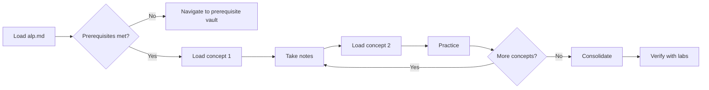

# ALP — Agent Learning Protocol v0.1

**ALP** (Agent Learning Protocol) is an open standard for representing structured learning pathways that AI agents can follow, just as MCP standardizes how agents access tools.

An ALP vault is a directory of markdown files that teaches an agent a domain or skill through progressive disclosure: start with the syllabus, load concepts on demand, practice with executable steps, and persist the knowledge in the agent's vault.

---

## Design Principles

1. **Simple** — Only markdown + YAML frontmatter + directory convention. No SDK, no runtime.
2. **Composable** — ALP vaults link to each other via `[[wiki-links]]`. Prerequisites reference other vaults.
3. **Progressive** — Load the syllabus (~200 tokens), then concepts on demand, then practice.
4. **Universal** — Works with any agent (Claude, Codex, Gemini, OpenCode), any source format, any LLM.
5. **Compatible** — An ALP vault is a valid OKF bundle with additional learning semantics.

---

## Directory Structure

```
alp-vault/
├── alp.md              # Vault metadata + syllabus (REQUIRED)
├── concepts/           # Concept chunks (at least 1 REQUIRED)
│   ├── 01-hello.md
│   ├── 02-world.md
│   └── ...
├── practices/          # Practice guides (OPTIONAL)
│   └── 01-exercise.md
├── labs/               # Hands-on labs (OPTIONAL)
│   └── ...
├── cheatsheet.md       # Quick reference (RECOMMENDED)
└── glossary.md         # Terminology (RECOMMENDED)
```

---

## File Format

### `alp.md` — Vault Metadata

Every ALP vault requires an `alp.md` at its root. This is the syllabus.

```yaml
---
type: alp-vault
alp-version: 0.1
name: semantic-search-tutorial
version: 1.0.0
description: A beginner-friendly tutorial for building semantic search with embeddings.
author: example-author
source: https://youtube.com/watch?v=xyz
source-type: youtube
prerequisites:
  - alp:python-basics
  - alp:vector-database-fundamentals
curriculum:
  - id: what-is-semantic-search
    title: What is Semantic Search?
    path: concepts/01-what-is-semantic-search.md
  - id: embeddings
    title: Understanding Embeddings
    path: concepts/02-embeddings.md
  - id: indexing
    title: Building the Index
    path: concepts/03-indexing.md
  - id: query
    title: Query & Rank
    path: concepts/04-query-and-rank.md
tags: [search, embeddings, nlp, python]
---
```

#### Fields

| Field | Required | Description |
|-------|----------|-------------|
| `type` | yes | MUST be `alp-vault` |
| `alp-version` | yes | Version of ALP spec |
| `name` | yes | Unique vault slug (lowercase, hyphens) |
| `description` | yes | One-line description (max 1024 chars) |
| `version` | recommended | Semantic version |
| `author` | recommended | Creator identifier |
| `source` | recommended | Original source URL (YouTube, blog, doc, etc.) |
| `source-type` | recommended | One of `youtube`, `blog`, `doc`, `live-lecture`, `screencast`, `course` |
| `prerequisites` | recommended | List of prerequisite ALP vault references |
| `curriculum` | yes | Ordered list of concepts in the learning path |
| `tags` | recommended | Categorization tags |

### Concept Files — `concepts/01-what-is-semantic-search.md`

Each concept is a focused, atomic chunk of knowledge.

```yaml
---
type: alp-concept
id: what-is-semantic-search
title: What is Semantic Search?
prerequisites: []
tags: [semantic-search, fundamentals]
---
Semantic search uses meaning, not keywords.

A keyword search looks for exact word matches. Semantic search
looks for the *intent* behind the query.

For example:
- Keyword: "best pizza NYC" → matches pages with those exact words
- Semantic: "best pizza NYC" → also matches "top-rated pizzerias New York"
```

#### Concept Fields

| Field | Required | Description |
|-------|----------|-------------|
| `type` | yes | MUST be `alp-concept` |
| `id` | yes | Unique ID within the vault |
| `title` | yes | Human-readable title |
| `prerequisites` | recommended | Concept IDs that should be understood first |
| `tags` | recommended | Categorization tags |

### Practice Files — `practices/01-setup.md`

Practice guides contain executable steps and expected outcomes.

```yaml
---
type: alp-practice
id: setup-environment
title: Set Up Your Environment
concepts-covered: [what-is-semantic-search]
---
## Steps

1. Install dependencies:
   ```bash
   pip install sentence-transformers numpy
   ```

2. Verify installation:
   ```bash
   python -c "from sentence_transformers import SentenceTransformer; print('ok')"
   ```
```

### Labs — `labs/01-build-search.md`

Labs are extended hands-on exercises with verification criteria.

```yaml
---
type: alp-lab
id: build-basic-search
title: Build a Basic Semantic Search
concepts-covered: [embeddings, indexing, query]
verification:
  - User can search 100+ documents in under 1 second
  - Results are ranked by semantic similarity
---
## Objective

Build a semantic search over a small corpus of documents.

## Requirements

- Python 3.10+
- sentence-transformers
- numpy

## Task

Implement a function `search(query, corpus, top_k=5)` that:
1. Encodes the query using `all-MiniLM-L6-v2`
2. Encodes all documents in the corpus
3. Returns the top_k most similar documents
```

### Cheatsheet — `cheatsheet.md`

Quick reference with common commands, patterns, and gotchas.

```yaml
---
type: alp-cheatsheet
---

## Commands

| Action | Command |
|--------|---------|
| Install | `pip install sentence-transformers` |
| Encode | `model.encode(["text"])` |
| Similarity | `np.dot(query_emb, doc_emb.T)` |
```

### Glossary — `glossary.md`

Key terminology with concise definitions.

```yaml
---
type: alp-glossary
---

| Term | Definition |
|------|------------|
| Embedding | A dense vector representation of text |
| Semantic Search | Search by meaning rather than keywords |
| Cosine Similarity | A measure of similarity between two vectors |
```

---

## Curriculum Navigation

The `curriculum` field in `alp.md` defines the **canonical learning path**.

An agent should:
1. **Load `alp.md`** — Parse metadata + curriculum, understand prerequisites.
2. **Check prerequisites** — If unmet, navigate to the prerequisite vault or skip.
3. **Load concepts in order** — Start from `curriculum[0]`, load each concept's file.
4. **Take notes** — Write structured notes in the agent's personal vault.
5. **Practice** — After relevant concepts, load and execute practice guides.
6. **Consolidate** — Generate cheat sheets, glossary entries, and summary notes.
7. **Verify** — Run lab exercises and check verification criteria.



---

## Progressive Loading Strategy

ALP is designed for finite context windows. The loading strategy is:

| Load Step | What | Approx. Tokens |
|-----------|------|----------------|
| 1. Discovery | `alp.md` metadata (name, description, tags) | ~100 |
| 2. Syllabus | `alp.md` full curriculum + prerequisites | ~200 |
| 3. Active concept | One concept file | ~500–2,000 |
| 4. Related concepts | [[wiki-links]] followed from active concept | ~500–2,000 each |
| 5. Practice | One practice guide | ~300–1,000 |
| 6. Reference | cheatsheet.md, glossary.md | ~200–500 |

An agent never loads more than 2–3 concepts simultaneously, keeping context usage under ~5K tokens for the learning path.

---

## Linking Conventions

ALP uses `[[wiki-links]]` for navigation between concepts:

- `[[what-is-semantic-search]]` — Link to another concept in the same vault
- `[[alp:python-basics/concepts/01-variables]]` — Link to a concept in another vault
- `[[practices/01-setup]]` — Link to a practice guide

Agents should render `[[wiki-links]]` as navigable links. When clicked/followed, the agent loads the target file into context.

---

## OKF Compatibility Profile

An ALP vault is a valid [OKF](https://github.com/GoogleCloudPlatform/knowledge-catalog/tree/main/okf) v0.1 bundle.

| ALP Type | OKF Type Equivalent | Notes |
|----------|---------------------|-------|
| `alp-vault` | `alp-vault` (extended type) | ALP profile type, extends OKF bundle |
| `alp-concept` | `alp-concept` (extended type) | ALP profile type, extends OKF concept |
| `alp-practice` | `alp-practice` (extended type) | ALP profile type |
| `alp-lab` | `alp-lab` (extended type) | ALP profile type |
| `alp-cheatsheet` | `alp-cheatsheet` (extended type) | ALP profile type |
| `alp-glossary` | `alp-glossary` (extended type) | ALP profile type |

**Interoperability rules:**
1. ALP frontmatter is a superset of OKF frontmatter. Every ALP file is a valid OKF file.
2. OKF consumers that do not understand ALP types will see them as custom types and can still index the content.
3. ALP `curriculum` field is ignored by OKF consumers (it's an extended field).
4. An OKF bundle can be converted to an ALP vault by adding `alp.md` + curriculum ordering.

---

## Source Extraction

ALP vaults can be created from any content source. The extraction process:

```
Source → Chunking → Frontmatter Generation → Linking → ALP Vault
```

| Source Type | Recommended Extractor |
|-------------|----------------------|
| YouTube | ASR transcript → LLM summarization → chunk at semantic boundaries |
| Blog/Doc | Parse headings → chunk by sections → generate frontmatter |
| Screencast | ASR + frame analysis → multimodal chunking |
| Live lecture | Real-time ASR → progressive vault construction |
| Course | Existing curriculum → convert each lesson to ALP vault |

---

## Security Considerations

ALP vaults are markdown files that agents read and potentially write. Follow these guidelines:

1. **Treat vaults as untrusted** — Like MCP servers, a vault could contain malicious instructions. Validate before execution.
2. **No executable code in YAML** — Frontmatter is metadata only. Never embed commands in frontmatter fields.
3. **Sandbox practice execution** — Practice steps may include shell commands. Execute in isolated environments.
4. **Provenance tracking** — The `source` and `author` fields enable trust decisions. Prefer vaults with known provenance.
5. **Read-only by default** — Agents should read vaults; writing should be explicit (note-taking to personal vault).

---

## Versioning

ALP uses semantic versioning for the spec (`alp-version: 0.1`).

Vaults use their own `version` field. Breaking changes to a vault should increment the major version.

The spec is at v0.1 — experimental. Expect changes as the ecosystem learns what works.

---

## License

This specification is published under the Apache 2.0 License. Free to use, implement, and extend.
